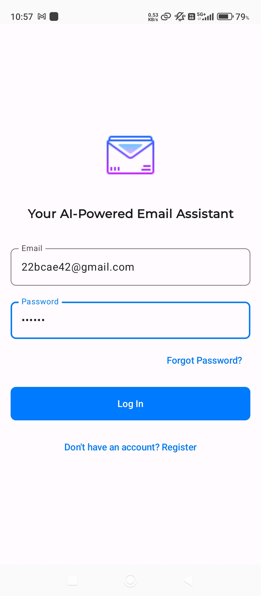

# Email Assistant App

A modern Android application for efficient email management, powered by AI. Built with Jetpack Compose and Firebase, it offers secure authentication, smart email summarization, and a chat-like interface for productivity.

---

## Table of Contents

- [Features](#features)
- [Screenshots](#screenshots)
- [Project Structure](#project-structure)
- [Getting Started](#getting-started)
- [Contributing](#contributing)
- [License](#license)
- [Acknowledgments](#acknowledgments)

---

## Features

- Secure user authentication (Firebase)
- AI-powered email summarization and response suggestions (Gemini 2.0 Flash)
- Gmail connectivity with 2FA and app password support
- Chat-style UI for summaries and replies
- Real-time feedback and error handling
- Responsive Material Design 3 interface

---

## Screenshots

### 1. Login and Registration

- **Login Screen**

  

- **New Registration**

  

---

### 2. Dashboard

- **Connecting Gmail**

  

- **Welcome Page**

  

- **Sidebar**

  

---

### 3. AI Summaries of Emails

- **AI Summary Example 1**

  

- **AI Summary Example 2**

  

---

### 4. AI Suggested Responses

- **Supporting the Agenda**

  

- **Against the Agenda**

  

---

## Project Structure

```
app/
├── src/
│   └── main/
│       ├── java/
│       │   └── com/
│       │       └── example/
│       │           └── emailassistantapp/
│       │               ├── components/
│       │               ├── network/
│       │               ├── userinterface/
│       │               ├── viewmodel/
│       │               └── data/
│       └── res/
│           ├── drawable/
│           ├── values/
│           ├── mipmap/
│           └── xml/
├── docs/
│   ├── Mobile Project Documentation.docx
│   └── Mobile Project Documentation.txt
├── build.gradle.kts
├── proguard-rules.pro
├── google-services.json
```

---

## Getting Started

### Prerequisites

- Android Studio Arctic Fox (2020.3.1) or newer
- Android SDK 23 or higher
- Kotlin 1.8.0 or higher
- Gradle 7.0 or higher

### Setup Instructions

1. **Clone the repository:**
   ```sh
   git clone https://github.com/yourusername/EmailAssistantApp.git
   ```
2. **Open in Android Studio:**
   - Open Android Studio and select "Open an existing project"
   - Navigate to the cloned repository
3. **Configure Firebase:**
   - Create a Firebase project at [Firebase Console](https://console.firebase.google.com/)
   - Add an Android app, download `google-services.json`, and place it in the `app/` directory
4. **Add Gemini API Key:**
   - Add your Gemini 2.0 Flash API key to `local.properties` as `GEMINI_API_KEY=your_api_key_here`
5. **Build and Run:**
   - Sync Gradle, build the project, and run on an emulator or device

---

## Contributing

Contributions are welcome!

- Fork this repository
- Create a new branch for your feature or bugfix
- Commit your changes with clear messages
- Open a pull request

---

## License

This project is licensed under the [MIT License](LICENSE).

---

## Acknowledgments

- Jetpack Compose team
- Firebase team
- Material Design team
- Gemini API team
