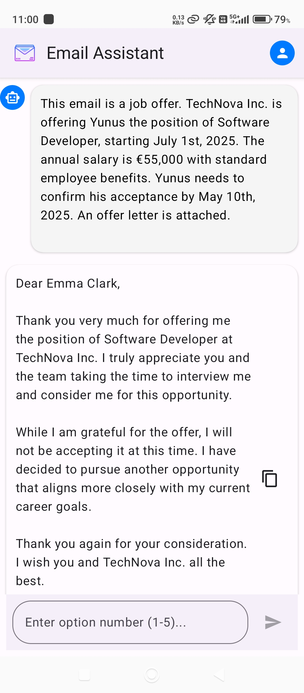

# Email Assistant App

**AI-Powered Android Email Client for Productivity and Smart Communication**

Email Assistant App is a modern Android application that transforms your email experience with advanced AI features. Built using Jetpack Compose and Firebase, it offers secure authentication, seamless Gmail integration (with 2FA and app password support), and intelligent email summarization powered by Gemini 2.0 Flash. The app features a chat-style interface for reading, summarizing, and replying to emails, helping you manage your inbox efficiently, save time, and respond with confidence. Designed for professionals, students, and anyone seeking to optimize their daily email workflow, Email Assistant App combines robust security, real-time feedback, and a beautiful Material Design 3 UI for a next-generation mobile email solution.
---

## Table of Contents

- [Features](#features)
- [Screenshots](#screenshots)
- [Project Structure](#project-structure)
- [Getting Started](#getting-started)
- [Usage Instructions](#usage-instructions)
- [Contributing](#contributing)
- [License](#license)


---

## Features

- Secure user authentication (Firebase)
- AI-powered email summarization and response suggestions (Gemini 2.0 Flash)
- Gmail connectivity with 2FA and app password support
- Chat-style UI for summaries and replies
- Real-time feedback and error handling
- Responsive Material Design 3 interface

## Screenshots

### 1. Login and Registration

- **Login Screen**

  

- **New Registration**

  

---

### 2. Dashboard

- **Connecting Gmail**

  

- **Welcome Page**

  

- **Sidebar**

  

---

### 3. AI Summaries of Emails

- **AI Summary Example 1**

  

- **AI Summary Example 2**

  

---
### 4. AI Suggested Responses

- **Supporting the Agenda**

  

- **Against the Agenda**

  

---

## Project Structure

```
app/
├── src/
│   └── main/
│       ├── java/
│       │   └── com/
│       │       └── example/
│       │           └── emailassistantapp/
│       │               ├── components/
│       │               ├── network/
│       │               ├── userinterface/
│       │               ├── viewmodel/
│       │               └── data/
│       └── res/
│           ├── drawable/
│           ├── values/
│           ├── mipmap/
│           └── xml/
├── docs/
│   ├── documentation and screenshots
│   
├── build.gradle.kts
├── proguard-rules.pro
├── google-services.json
```

---

## Getting Started

### Prerequisites

- Android Studio Arctic Fox (2020.3.1) or newer
- Android SDK 23 or higher
- Kotlin 1.8.0 or higher
- Gradle 7.0 or higher

### Setup Instructions

1. **Clone the repository:**
   ```sh
   git clone https://github.com/yourusername/EmailAssistantApp.git
   ```
2. **Open in Android Studio:**
   - Open Android Studio and select "Open an existing project"
   - Navigate to the cloned repository
3. **Configure Firebase:**
   - Create a Firebase project at [Firebase Console](https://console.firebase.google.com/)
   - Add an Android app, download `google-services.json`, and place it in the `app/` directory
4. **Add Gemini API Key:**
   - Add your Gemini 2.0 Flash API key to `local.properties` as `GEMINI_API_KEY=your_api_key_here`
5. **Build and Run:**
   - Sync Gradle, build the project, and run on an emulator or device

---

## Usage Instructions

1. **Login or Register**
   - Launch the app and log in with your existing account, or register a new account using your email and password.

2. **Connect Your Gmail Account**
   - After logging in, follow the prompts to connect your Gmail account.
   - If you have 2FA enabled, generate an app password in your Google Account and use it for authentication.

3. **Fetch Emails**
   - On the dashboard, tap the "Fetch Daily Report" button to retrieve your latest unread emails.

4. **View AI Summaries**
   - Each email will be displayed with an AI-generated summary, showing the main points and required actions.

5. **AI Suggested Responses**
   - For actionable emails (e.g., offers or requests), enter the option number in the textbox for AI-generated reply suggestions.
   - Tap the copy icon to copy a suggested response to your clipboard.

6. **Refresh Inbox**
   - Use the refresh option to update your inbox and fetch new emails.

7. **Logout**
   - Use the sidebar or profile menu to log out of your account at any time securely.

---

## Contributing

Contributions are welcome!

- Fork this repository
- Create a new branch for your feature or bugfix
- Commit your changes with clear messages
- Open a pull request

---

## License

This project is licensed under the [MIT License](LICENSE).

---


